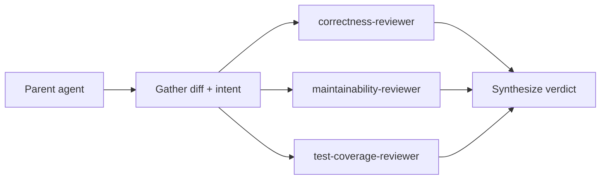

# Code Review Subagent Demo

This folder demonstrates how to orchestrate **parallel Cursor subagents** for structured code review. Copy or symlink it into `.cursor/plugins/` (or reference paths from chat) to use as a workspace plugin.

**Location in repo:** `contribute/agent-demos/code-review-subagents/`

## What it shows

1. **Orchestrator skill** (`code-review-subagents`) gathers a diff, states intent, and spawns reviewers in parallel.
2. **Three focused subagents** each review from one angle instead of one monolithic pass:
   - `correctness-reviewer` — bugs, security, regressions
   - `maintainability-reviewer` — structure, coupling, readability
   - `test-coverage-reviewer` — missing tests and edge cases
3. **Demo sample** (`demo/sample/`) contains intentional issues to practice on.

## Quick start

In Cursor chat, ask:

```
Run the code-review-subagents skill on demo/sample/user_quota.go
```

Or review your current branch:

```
/code-review-subagents
```

## Orchestration flow



### Step-by-step (what the parent agent does)

1. **Scope** — `git diff main...HEAD`, or read explicit files the user named.
2. **Intent** — one paragraph: what the change is trying to accomplish.
3. **Parallel spawn** — three `Task` calls in a **single message**:
   - `subagent_type: "correctness-reviewer"`, `readonly: true`
   - `subagent_type: "maintainability-reviewer"`, `readonly: true`
   - `subagent_type: "test-coverage-reviewer"`, `readonly: true`
4. **Synthesize** — merge findings into Act On / Consider / Noted buckets (see skill output format).

## Demo sample issues (spoilers)

`demo/sample/user_quota.go` intentionally includes:

- SQL string concatenation (injection risk)
- Unchecked error from `rows.Close()`
- Magic numbers and duplicated logic
- No unit tests for edge cases (zero quota, negative usage)

Run the skill against that file to see all three reviewers flag different classes of problems.

## Components

| Path | Role |
|:-----|:-----|
| `skills/code-review-subagents/SKILL.md` | Orchestrator workflow |
| `agents/correctness-reviewer.md` | Bug and security subagent |
| `agents/maintainability-reviewer.md` | Structure subagent |
| `agents/test-coverage-reviewer.md` | Test gap subagent |
| `demo/sample/user_quota.go` | Practice target |

## Extending the demo

- Add a fourth reviewer (e.g. `api-contract-reviewer`) and register it in `agents/`.
- Point reviewers at Grafana-specific rules in `AGENTS.md` or `contribute/backend/style-guide.md`.
- Chain with `thermo-nuclear-code-quality-review` from cursor-team-kit for a harsher maintainability pass.

## Related Cursor docs

- [Subagents](https://cursor.com/docs/subagents)
- [Agent Skills](https://cursor.com/docs/agent/skills)
